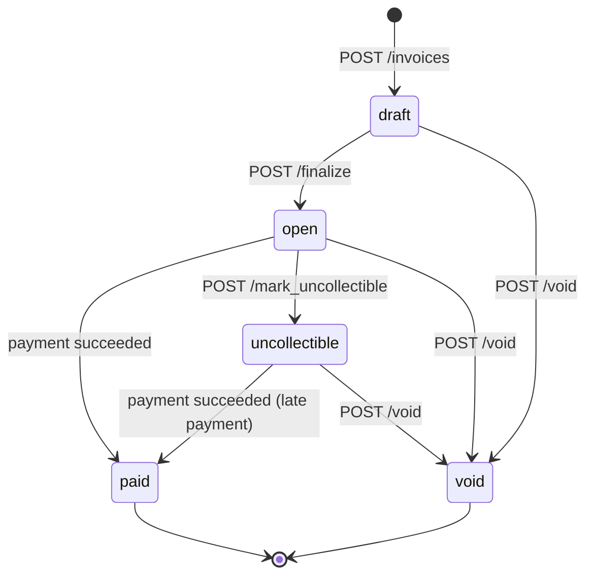

# Design

Businesses bill customers, customers pay through a PSP, businesses hear about it through signed webhooks. Processes: `invoice-service` (API + two background workers), `mock-psp`, Postgres.

```
client ──HTTP──▶ invoice-service ──HTTP──▶ mock-psp
                  │   ▲    └─ payment reconciler (re-checks unknown outcomes)
                  ▼   │
                Postgres ◀── webhook dispatcher ──HTTP──▶ business endpoint
              (state + outbox)
```

## 1. Data model

| Table | Notable columns and constraints | Indexes |
|---|---|---|
| `businesses` | name | PK |
| `api_keys` | `key_prefix`, `key_hash` (SHA-256), `revoked_at` | `key_hash` unique |
| `customers` | name, email, `UNIQUE (business_id, id)` | (business_id, id) |
| `invoices` | status, `total_cents BIGINT > 0`, due_date, a timestamp per transition; `FK (business_id, customer_id) → customers`; `CHECK ((status='paid') = (paid_at IS NOT NULL))`, same for void | (business_id, id), (business_id, status, id) |
| `invoice_line_items` | quantity, unit_amount_cents, `CHECK (amount_cents = quantity * unit_amount_cents)` | (invoice_id, position) unique |
| `payment_attempts` | status `pending/succeeded/failed`, amount, card_token, **idempotency_key**, psp_ref, failure_code, next_recheck_at | `UNIQUE (business_id, idempotency_key)`; partial unique `(invoice_id) WHERE pending`; partial unique `(invoice_id) WHERE succeeded` |
| `events` | type, payload JSONB (the exact webhook envelope) | (business_id, id) |
| `webhook_endpoints` | url, secret, disabled_at | active per business |
| `webhook_deliveries` | status, attempt_count, next_attempt_at, last_response_status | partial `(next_attempt_at) WHERE pending` |

- **UUIDv7 primary keys**, generated in the app: safe to expose, and time-ordered, so B-tree inserts stay append-mostly and `ORDER BY id DESC` is creation order. That makes cursor pagination (`starting_after`) an index range scan.
- **Money is `BIGINT` cents everywhere.** `serde` rejects `99.99` for an `i64`, so a float never enters the process.
- **The composite FK** makes "an invoice's customer belongs to the same business" a database guarantee rather than a handler convention.
- **The idempotency key lives on `payment_attempts`**, not in a generic table. A key means exactly "this attempt"; a second table would be a copy that can disagree.

**At 100x:** partition `events` and `webhook_deliveries` by month and archive old ones; move the dispatcher from polling to a queue; send list endpoints to a read replica; move re-check scheduling into a small work table so the hot `payment_attempts` table has no scheduling churn.

## 2. Invoice state machine



- **Terminal:** `paid`, `void`. A **failed payment is not a transition**: the invoice stays payable.
- **Reversibility:** nothing returns to `draft` or `open`. `uncollectible → paid` is the one recovery edge: written-off money that arrives anyway is accepted. A wrongly voided invoice is re-issued, which keeps the history honest.
- **Overdue** is derived (`open` and past `due_date`), not a state: it changes with the clock, not with an event.
- **There is no `processing` state.** An in-flight payment is a `pending` *attempt*. Putting it on the invoice would need `uncollectible → processing → uncollectible`, a state machine that remembers where it came from.

**How invalid transitions are rejected.** `InvoiceStatus::apply(action)` (`invoices/state.rs`) is the only code that decides legality, and a unit test checks all 20 state×action pairs against the diagram. Callers hold `SELECT … FOR UPDATE` on the invoice, then write with a compare-and-set (`WHERE status = $expected`). Illegal moves return `409 invalid_state_transition` ("cannot void an invoice that is paid"). While an attempt is pending, `void` and `mark_uncollectible` return `409 payment_in_progress`, because that charge may still succeed.

## 3. Payment correctness and failure modes

`POST /pay` runs in three steps, and **no lock or transaction is held across the PSP call**:

1. **Begin** (one transaction): lock the invoice, check that it is payable and has no pending attempt, and insert a `pending` attempt with `next_recheck_at = now + psp_timeout + 10s`.
2. **Charge:** call the PSP with a 5s timeout and `Idempotency-Key: <attempt id>`.
3. **Settle** (one transaction): lock the invoice again and record the outcome in the same transaction as its outbox event.

The PSP client sorts every response into three buckets. **Succeeded.** **Failed:** a decline, a 4xx, or *connection refused*, which provably never reached the PSP. **Unknown:** a timeout, 5xx, 409, or reset connection, where the card may have been charged. Treating unknown as failed is how double charges happen.

**Concurrency mechanism: a row-level lock** on the invoice serialises check-then-insert. Partial unique indexes back it up. To check the backstop, I deleted the lock *and* the pending-attempt check: the 20-client concurrency test still passed, because the index rejected every duplicate. Why not the alternatives:
- *Advisory locks* live apart from the data they guard and leak easily with pooled connections.
- *SERIALIZABLE* turns every conflict into a retry loop.
- *Optimistic versioning* guards one-row updates, but this check spans two tables.

The row lock is held for milliseconds. For the seconds the PSP takes, the durable `pending` row is what blocks competing payments.

**(a) Two clients pay the same invoice at the same instant.** Both transactions queue on the invoice lock. The first inserts a pending attempt, commits, and calls the PSP. The second then sees that attempt and gets `409 payment_in_progress` (with its id), or `409 invoice_already_paid` if the first has already settled. Only one request reaches the PSP. With the *same* key, the second re-reads the key under the lock and replays the first's attempt (`202`, then `200`). Both variants are tested with 20 concurrent clients.

**(b) PSP timeout (`tok_timeout`).** After 5s we return **`202 Accepted`** with the attempt `pending` and the invoice still `open`. New payments and `void` get `409 payment_in_progress`. The reconciler replays the same PSP key after gaps of 10s, 30s, 1m, 2m, 5m and 10m. Against the mock, the first re-check gets `409` (the charge is still sleeping) and the second gets the stored success, so the invoice becomes `paid` with a single charge and `invoice.paid` fires. The caller finds out via that webhook, `GET /invoices/{id}/payment_attempts`, or by retrying with the same key.

*The deliberate trade-off:* if every re-check stays unknown (~19 min, e.g. `tok_network_error`), the attempt becomes `failed/psp_unavailable`, the invoice becomes payable again, and we log at ERROR. Each re-check replayed the same idempotency key, and a PSP that had charged would have returned that success. The residual risk is an outage longer than the whole budget. Settlement reconciliation (§7) is the right answer to that; an invoice blocked forever is not.

**(c) PSP succeeds, we crash before persisting.** The attempt was committed as `pending`, with a re-check time, *before* the call. After restart the reconciler replays the key and records the PSP's original answer (same `psp_ref`). There is no second charge: the PSP dedupes on the attempt id, the unique index blocks new attempts, and client retries replay the existing attempt. Covered by `crash_between_charge_and_settle_is_recovered_without_double_charge`.

**(d) Key reused with a different body.** `422 idempotency_key_reused`. Keys are scoped to the business and bound forever to one attempt; a replay must match its `invoice_id` and `card_token`. Requests rejected *before* an attempt exists (404, not payable, in progress) bind nothing: they had no side effects, so re-running them reports the current truth.

**(e) `POST /pay` on a paid invoice.** Checked under the lock: `409 invoice_already_paid`, no PSP call. If it uses the key that paid the invoice, the original `200` is replayed with `Idempotent-Replayed: true`.

## 4. Webhooks

- **Signing:** [Standard Webhooks](https://www.standardwebhooks.com), so receivers can use existing verifiers. `webhook-signature: v1,base64(HMAC-SHA256(secret, "{id}.{timestamp}.{body}"))` with a 32-byte per-endpoint secret. The implementation is checked against the spec's published test vector.
- **Replay protection:** the id and timestamp are inside the MAC. Receivers reject timestamps more than 5 minutes off and dedupe on `webhook-id`, the event id, which is stable across retries.
- **Retries:** non-2xx, timeout (10s) and redirects all count as failures. Attempts go out at 0, +5s, +5m, +30m, +2h, +5h, +10h, +10h with ±10% jitter: **8 attempts over ~27.6h**.
- **Exhausted budget:** the delivery is marked `failed`, visible in `GET /webhook_endpoints/{id}/deliveries`, and logged at ERROR.
- **Reconciliation:** `GET /v1/events` returns every event in its exact delivered envelope. It is the source of truth; webhooks are notifications. Delivery is at-least-once and unordered, so receivers should trust `data.invoice.status`.
- **Decoupling (transactional outbox):** events and per-endpoint delivery rows are inserted in the *same transaction* as the state change, so a webhook exists if and only if that change committed. A background dispatcher claims due rows with `FOR UPDATE SKIP LOCKED` plus a 60s lease (safe across instances), sends them, and records the result. The API never waits on a receiver.

## 5. API keys

- **Generation:** `sk_` + 40 base62 characters from a CSPRNG (~238 bits).
- **Storage:** a SHA-256 digest (unique-indexed; that is the lookup) plus an 11-character display prefix. The plaintext is shown exactly once. A slow KDF protects low-entropy passwords; for 238 random bits it would only add latency to every request.
- **Transmission:** `Authorization: Bearer`, over TLS terminated at the load balancer.
- **Rotation:** several active keys per business. Create a new one, deploy it, revoke the old one.
- **Revocation:** `revoked_at`, effective on the next request (there is no auth cache).
- **Blast radius:** one business, fully. A thief can read its customers' PII, void invoices, or register a webhook endpoint to siphon events. Other tenants are safe: every query is scoped by `business_id`, and the composite FK holds. Next steps would be restricted keys, `sk_live_`/`sk_test_` prefixes (which also help secret scanners), and `last_used_at`.

## 6. What I cut and why

1. **Editing drafts.** Line items are immutable, and `draft` just means "not issued yet". Editing needs PATCH semantics and recalculation, and none of it touches the payment path.
2. **Idempotency on other POSTs.** Only `/pay` moves money, and a duplicate invoice is visible and voidable. This is the next thing I'd add.
3. **Webhook endpoint hygiene:** secret rotation (the verifier already accepts multiple signatures), manual redelivery, auto-disabling dead endpoints, and **SSRF protection**. SSRF protection is mandatory in production, but blocking private IPs would break this docker demo.
4. **Settlement reconciliation** against PSP reports, the real backstop for §3(b).
5. **Idempotency key expiry.** Keys are unique forever per business (stricter than Stripe's 24h), and there is no cleanup job.

## 7. Production readiness gaps

1. **Observability.** Only structured logs with request ids exist today. Needed: metrics and alerts on the oldest pending attempt's age, re-check exhaustions (should be ~0), webhook backlog, and PSP latency and error rate.
2. **Rate limiting and card-testing defence.** Per-key limits, plus velocity limits on `/pay`. Otherwise `/pay` is an oracle for testing stolen cards.
3. **Audit log and money reconciliation.** Record who voided what (`api_key_id` on every mutation). Run a daily match of PSP settlements against `succeeded` attempts that feeds a refund flow. Refunds would turn "one success per invoice" into "captured − refunded ≤ total".
